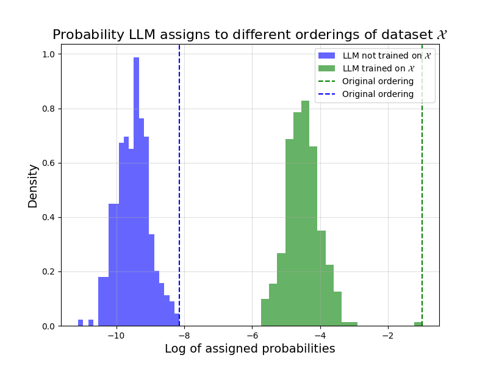

**Prerequisites**: Advanced undergraduate level understanding of probability, statistical inference, and large language models. 

## Overview

In this post, I'll offer some commentary on Oren et al.'s method[^1] for detecting test set contamination in black box language models (LLMs). Oren et al. propose a method (that has received quite a bit of academic attention since its inception) for detecting whether or not an LLM was trained on a particular benchmark dataset. Specifically, they consider datasets that are composed of an ordered list of examples, like the BoolQ dataset[^2]:

1. **Question**: Does France have a Prime Minister and a President?  
   **Passage**: ... The extent to which those decisions lie with the Prime Minister or President depends upon ...  
   **Answer**: Yes. [Both are mentioned, so it can be inferred both exist.]

2. **Question**: Have the San Jose Sharks won a Stanley Cup?  
   **Passage**: ... The Sharks have advanced to the Stanley Cup finals once, losing to the Pittsburgh Penguins in 2016 ...  
   **Answer**: No. [They were in the finals once, and lost.]

3. ... 

Their proposed method relies on querying the LLM to find the probability it assigns to certain text chunks (precisely, this is the probability of the LLM itself generating the text chunk from scratch). Since LLMs have a tendency to "memorize" text that they're trained on, we may expect this probability to be abnormally high for text chunks that the LLM saw during training. Oren et al.'s idea is simple: if the LLM has seen the BoolQ dataset, then the probability it assigns to the original dataset will be higher than the probability it assigns to re-orderings of the dataset (i.e., the same dataset but with the examples shuffled). This is because the LLM will be biased towards the specific ordering it saw during training, and should therefore deem this original ordering more likely than the rest.

Oren et al.'s procedure can be instantiated as follows. Have the LLM assign a probability to $$1000$$ random re-orderings of the BoolQ dataset. If the probability it assigns to the originally ordered dataset is in the top $$5\%$$ of these probabilities, then declare that the LLM was trained on the BoolQ dataset.

To a statistician, this procedure feels like a permutation test, and indeed it is presented in the paper as such. The authors use this connection to establish a statistical guarantee for their method: the probability of falsely claiming test set contamination will be at most $$5\%$$. After reading the paper, however, I was left wondering (1) if this connection to permutation testing was formally correct and (2) if the provided statistical guarantee was in line with what users actually want. In my initial attempts of working through their reasoning, I found myself forced to make additional assumptions that seemed both unreasonable and unnecessary. This post mainly stems from me convincing myself that their method behaves and can be formalized as intended.

Overall, the post's discussion will center on answering the question, "where is the randomness in the problem?" When doing statistical work, this is one of the first questions we should try and answer. For the current problem, answering this question naturally presents us with a more clear and formal argument for the validity of the procedure, and it also provides us with a better understanding of the procedure's associated statistical guarantee. I only discuss the "permutation testing" approach from the paper and not the "sharded likelihood comparison test" approach, which was the more the powerful of the two in experiments. I believe it is possible to provide an analogous discussion for the latter method, but doing so would require some more subtle and advanced statistical reasoning, so I'll leave it for another time.

## Existing description

Let's go over the current set-up in Oren et al.'s article. They assume we have a random dataset $$X = (X_1, \dots, X_n)$$ that is composed of $$n$$ examples. Crucially, they assume that the examples are *exchangeable*, meaning their joint distribution remains the same even after application of an arbitrary permutation $$\pi$$:

$$
(X_1, \dots, X_n) \overset{d}{=} (X_{\pi(1)}, \dots, X_{\pi(n)})
$$

They also consider an LLM parameterized by $$\theta$$. The LLM assigns probability to text chunks via some function $$p_{\theta}(\cdot)$$. Ultimately, they aim to test the null hypothesis that the dataset $$X$$ is independent from the LLM $$\theta$$:

$$
H_0 : \theta \perp X
$$

$$
H_a : \theta \not \perp X
$$

The authors correctly argue that, under the null, the earlier described permutation test will falsely reject at most $$5\%$$ of the time. They use two crucial facts to show this: (1) the examples in $$X$$ are exchangeable and (2) $$\theta$$ and $$X$$ are independent under the null.

Things get a bit murky, however, when the authors say we can claim dataset contamination when this test rejects. Their reasoning for suggesting so is as follows: If there is no contamination (i.e., the LLM was not trained on $$X$$) then $$\theta$$ and $$X$$ should be independent, and the null should be true. Therefore, if we claim contamination when the test rejects, our probability of falsely claiming contamination will be at most $$5\%$$.

But is it really fair to say that if the LLM is not trained on $$X$$, then $$\theta$$ is independent of $$X$$? It's hard to reason about independence unless we explicitly write out all the randomness in our system, so let's try and do so. The LLM $$\theta$$ should always be trained on some training corpus $$C$$. Since our dataset $$X$$ is random, we should presumably also model the corpus $$C$$ as random. When the LLM $$\theta(C, X, U)$$  is trained on the dataset $$X$$, we can write it as a function of the training corpus $$C$$, the dataset $$X$$, and an independent uniform random variable $$U$$ that governs randomness in the training process. When it is not trained on $$X$$, the LLM $$\theta(C, U)$$ is just a function of $$C$$ and $$U$$. But why should we expect that $$\theta(C, U)$$ is independent of $$X$$? Surely, our dataset $$X$$ should not be modeled as independent of the entire training corpus $$C$$, which contains swaths of text pre-dating it. After all, contemporary text is directly influenced by what came before.

Treating the dataset $$X$$ and training corpus $$C$$ as random is a modeling choice that can perhaps be executed reasonably, but it opens up a philosophical can of worms that I believe is best left closed. Unless we get into the nitty-gritty of how random text is sampled, it's not clear whether or not the authors' argument should go through.

Also, if we treat $$C$$ and $$X$$ as random, the established statistical guarantee strays from what we desire. Technically, the guarantee becomes the following: if we resample an entirely new training corpus $$C$$ and independent dataset $$X$$, train an LLM on just the new corpus $$C$$, and then run our procedure, we will falsely claim that we trained on the new dataset $$X$$ at most $$5\%$$ of the time. This is not the guarantee we actually want, which is that if we take an LLM trained on our *currently observed* corpus and run our procedure on a collection of datasets it wasn't trained on, then we will falsely claim it was trained on only $$\approx 5\%$$ of these datasets.

So we're left in a weird place. Oren et al. have provided us with a reasonable sounding procedure, but at best we have to make unreasonable assumptions to provide it with an undesirable guarantee. The rest of the post is devoted to getting around these annoyances, and showing how to establish a desirable guarantee with almost no assumptions.

*A brief technical note: an experienced statistician may at this point realize that everything becomes much more reasonable if we analyze the procedure conditional on the training corpus. Indeed, this is roughly what's to come.*

## Struggles without randomness

Let's take a stab at re-analyzing the problem. Upon my first glance, I felt there was very little need for randomness. We have a pre-specified training corpus $$\mathcal{C}$$ and a fixed, ordered dataset $$\mathcal{X} = (x_1, \dots, x_n)$$ of interest (the $$x_i$$ are our examples). When things feel non-random, I find that it's best to start analyzing the problem with no randomness involved, and see how far we get.

Even without randomness, the thesis behind Oren et al.'s procedure remains. If the LLM is trained on a particular chunk of text, it should assign said text chunk a higher probability. Thus, when it is trained on the dataset $$\mathcal{X}$$, the probability it assigns to the original ordering should be the higher than other re-orderings. The below hypothetical scenario, however, illustrates the troubles that arise from following this intuition blindly:

The above plot displays hypothetical LLM assigned (log) probabilities for different orderings of a dataset $$\mathcal{X}$$. The green distribution corresponds to the case where the LLM was trained on $$\mathcal{X}$$, whereas the blue distribution corresponds to the case that it was not. In each case, the dashed line marks the probability assigned to the original ordering.

In the case that the LLM was trained on $$\mathcal{X}$$, the original ordering indeed has the highest probability, and by a large margin at that. The issue is, it just so happens in the other case (i.e., the case that the LLM was *not* trained on $$\mathcal{X}$$) that the original ordering also has the highest probability. Thus, in this hypothetical scenario, Oren et al.'s procedure always tell us to claim that the LLM was trained on $$\mathcal{X}$$, even if it wasn't.

If the examples $$x_i$$ in our dataset $$\mathcal{X}$$ really have nothing to do with each other, this hypothetical scenario feels "unlikely". It feels unlikely that, in the case where the LLM is not trained on $$\mathcal{X}$$, the original ordering just happens to be the one with the highest assigned probability. But without any randomness, there is no notion of likely or unlikely. We simply have to acknowledge that this is a possible scenario, and therefore that our method cannot come with any guarantee.

The good news is, this line of thinking allows us to identify where randomness may be an appropriate and useful modeling choice. Why does it feel unlikely that the dataset happens to be in the particular ordering that the LLM, when not trained on $$\mathcal{X}$$, assigns the highest probability to? Perhaps because it is natural to imagine that the dataset was equally likely to be assembled in any ordering, and therefore that the probability of it being assembled in this particular "optimal" ordering is incredibly small. Indeed, if we model the *ordering* of the dataset $$\mathcal{X}$$ as random, then the above hypothetical scenario truly becomes unlikely, and we can establish a desirable statistical guarantee for Oren et al.'s procedure.

## A rigorous treatment

Let's present a new formalization of the problem. We'll consider a fixed training corpus $$\mathcal{C}$$ and a fixed dataset $$\mathcal{X} = \{x_1, \dots, x_n\}$$ that consists of an unordered set of fixed examples. We'll also consider a uniformly random permutation $$\pi$$ (equally likely to be any permutation) and assume that the dataset $$\mathcal{X}$$ is published in some random ordering:

$$
X = (x_{\pi(1)}, \dots, x_{\pi(n)}). 
$$

Crucially, when the LLM is trained on the dataset in question, it is trained on the published dataset $$X$$ and therefore exposed to the ordering $$\pi$$. Note two things. First, even though $$\mathcal{X}$$ is fixed, $$X$$ is random due to the presence of the random permutation $$\pi$$. Second, and this is not too hard to reason through, $$X$$ has exchangeable entries, just as was assumed and needed in the paper's original analysis.

Again, we consider an LLM parameterized by $$\theta$$. When the LLM is trained on the dataset, it is a function $$\theta(\mathcal{C}, \mathcal{X}, \pi, U)$$ of the fixed training corpus $$\mathcal{C}$$, the fixed set of examples $$\mathcal{X}$$, the random ordering of the examples $$\pi$$, and an independent uniform random variable $$U$$ that captures any randomness in the training process. On the other hand, if the LLM is not trained on the dataset, then it is just a function $$\theta(\mathcal{C}, U)$$ of $$\mathcal{C}$$ and $$U$$, and it is clearly independent of the permutation $$\pi$$.

We can now think of Oren et al.'s permutation test as testing the null:

$$
H_0 : \theta \perp \pi
$$

$$
H_a : \theta \not \perp \pi
$$

It still remains true that (1) the examples in $$X$$ are exchangeable, and, since $$X$$ is purely function of $$\mathcal{X}$$ and $$\pi$$, that (2) $$\theta$$ and $$X$$ are independent under the null. Therefore, the original reasoning from the paper maintains that our permutation test will falsely reject this null at most $$5\%$$ of the time.

Now, however, it is clear that we can claim contamination when our test rejects. If we haven't trained on the dataset, then $$\pi$$ and $$\theta$$ are independent (as discussed earlier), and we are certainly under the null. Therefore, by claiming contamination when the test rejects, we will falsely claim that there was contamination at most $$5\%$$ of the time.

What does this statistical guarantee mean for us? At face value, it tells us that if we take a dataset we haven't trained on, randomly re-order it, and then run Oren et al.'s procedure, we will falsely reject for $$\approx 5\%$$ of these re-orderings. A natural consequence of this, however, is that if we take a collection of datasets that we haven't trained on, each of which has examples that were randomly ordered (our core assumption), then we will falsely claim that we trained on only $$\approx 5\%$$ of these datasets. For our problem, this is the desired guarantee.

Lastly, it's worth discussing whether modeling the published dataset's ordering as uniformly random is reasonable. From my perspective, it does seems reasonable to think that, in many cases, the human(s) piecing together an ordered dataset have no ordering preferences and effectively act as random number generators when determining the examples' order. There are situations, however, that would lead us to question this assumption. What if some examples have a common theme and are purposefully grouped together? This would make our random ordering model inaccurate, and could certainly lead to violations of our claimed statistical guarantee.

This is where things get a bit interesting. If we all agreed as a community to just once randomly shuffle datasets like BoolQ prior to publishing them, we could automatically ensure that this random ordering assumption holds. Essentially, by all agreeing to inject randomness into our datasets in a systematic way, we enable ourselves to unambiguously provide statistical guarantees for this problem while making *no assumptions* about human behavior. The authors mention this in their discussion section, and I find it pretty neat.

## Some (brief) discussion

In my opinion, the careful statistical thinking we've applied in this post helps to clarify the capabilities and limitations of Oren et al.'s procedure. To support this claim, I'll highlight two practical considerations that are immediate from our treatment, but I find less immediate in the method's original presentation. First, the method only maintains a statistical guarantee when it's used to detect highly structured datasets, like the BoolQ dataset. If the dataset is a standard long-form document, for example, then the required assumptions will not hold. It is neither reasonable to expect that, say, the paragraph ordering in a document is random, or to demand that people randomly shuffle a document's paragraphs prior to publishing it. Second, our re-writing makes it more clear that the procedure uses information solely from the dataset's ordering and not from its textual content. I suspect it's quite a bit easier for an LLM to memorize particular phrases and sentences than a specific ordering of unrelated examples, especially when it's trained on a huge training corpus. Most likely, there's a lot to be gained by figuring out how to leverage information in the actual text itself.

## Acknowledgements

I'd like to thank Yash Nair, to whom I go to with all my permutation testing questions, for discussing this post with me as I wrote it. I'd also like to thank Tim Morrison for reading and offering comments on an earlier draft. 

## References

[^1]: Oren, Y., Meister, N., Chatterji, N., Ladhak, F., & Hashimoto, T. B. (2023). *Proving Test Set Contamination in Black Box Language Models*. [arXiv:2310.17623](https://arxiv.org/abs/2310.17623).

[^2]: Clark, C., Lee, K., Chang, M. W., Kwiatkowski, T., Collins, M., & Toutanova, K. (2019). *BoolQ: Exploring the Surprising Difficulty of Natural Yes/No Questions*. [arXiv:1905.10044](https://arxiv.org/abs/1905.10044).
